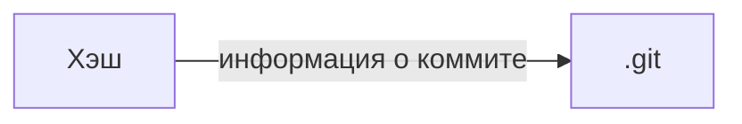
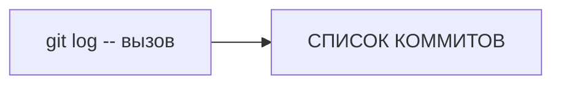
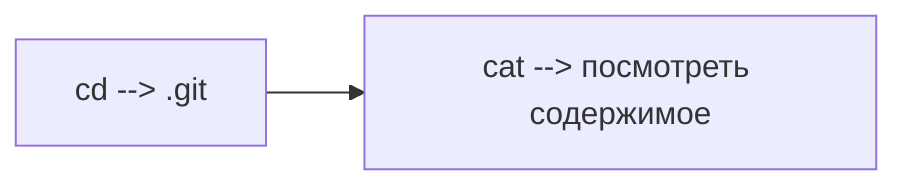

# Конспект по Git

## Основные понятия

**Git** - система контроля версий, которая отслеживает изменения в файлах.

**Репозиторий** - хранилище вашего проекта с историей изменений.

## Основные команды

### Настройка
```bash
git config --global user.name "Ваше Имя"
git config --global user.email "ваш@email.com"
```

### Создание и клонирование
```bash
git init                    # создать новый репозиторий
git clone <url-репозитория> # склонировать существующий репозиторий
```

### Основной workflow
```bash
git status                  # посмотреть статус файлов
git add <файл>             # добавить файл в staging area
git add .                  # добавить все файлы
git commit -m "сообщение"  # зафиксировать изменения
git log                    # посмотреть историю коммитов
```

### Работа с ветками
```bash
git branch                 # посмотреть список веток
git branch <имя-ветки>     # создать новую ветку
git checkout <имя-ветки>   # переключиться на ветку
git checkout -b <имя-ветки> # создать и переключиться на ветку
git merge <имя-ветки>      # объединить ветки
```

### Работа с удаленным репозиторием
```bash
git push origin <ветка>    # отправить изменения на сервер
git pull origin <ветка>    # получить изменения с сервера
git fetch                 # получить информацию об изменениях
```

## Полезные команды

```bash
git diff                  # посмотреть изменения в файлах
git reset <файл>          # убрать файл из staging area
git rm <файл>            # удалить файл из репозитория
git stash                # временно сохранить изменения
```

## Типичный workflow

1. `git pull` - получить свежие изменения
2. Внести изменения в файлы
3. `git add .` - добавить файлы
4. `git commit -m "описание изменений"` - закоммитить
5. `git push` - отправить на сервер

## Полезные ссылки

- [Официальная документация](https://git-scm.com/doc)
- [GitHub Guides](https://guides.github.com/)

## Хеш - идентификатор коммита 

- Git преобразует информацию о коммитах с помощью алгоритма SHA-1 и для каждого из них рассчитывает уникальный идентификатор — хеш.
- Хеш — основной идентификатор коммита и позволяет узнать его автора, дату и содержимое закоммиченных файлов.
- Все хеши, а также таблицу соответствий хеш → информация о коммите Git хранит в папке .git.


## Исследуем лог

### Элементы описания коммита 

- строка из цифр и латинских букв после слова commit — это хеш коммита;
- Author — имя автора и его электронная почта;
- Date — дата и время создания коммита;
- в конце находится сообщение коммита.


- Можно вызвать не только полный лог, но и сокращённый — это делается командой git log --oneline.
- В сокращённом логе выводятся сокращённые хеши — их можно использовать точно так же, как и полные.

## HEAD всему голова 

### Файл HEAD

Файл HEAD (англ. «голова», «головной») — один из служебных файлов папки .git. Он указывает на коммит, который сделан последним (то есть на самый новый).
В этом можно убедиться с помощью терминала. Перейдите в папку .git командой cd. Посмотрите содержимое файла HEAD командой cat.


Папка .git содержит много непонятных файлов — об одном из них мы рассказали в этом уроке. Подытожим:
- В числе прочих файлов в папке .git есть служебный файл HEAD. Он указывает на самый свежий коммит.
- Вместо хеша последнего коммита можно написать слово HEAD — Git вас поймёт.

## Статусы файлов в Git

### Статусы
1. Файл только что создали. Git ещё не отслеживает содержимое этого файла. Состояние: untracked.
2. Файл добавили в staging area с помощью git add. Состояние: staged (+ tracked).
3. Возможно, изменили файл ещё раз. Состояния: staged, modified (+ tracked).
4. Обратите внимание: staged и modified у одного файла, но у разных его версий.
5. Ещё раз выполнили git add. Состояние: staged (+ tracked).
6. Сделали коммит с помощью git commit. Состояние: tracked.
7. Изменили файл. Состояние: modified (+ tracked).
8. Снова добавили в staging area с помощью git add. Состояния: staged (+ tracked).
9. Сделали коммит. Состояния: tracked.
10. Повторили пункты 4−7 много-много раз.

###  Важное:
- Статусом untracked помечается файл, о существовании которого Git знает, но не следит за изменениями в нём. Этот статус — противоположность tracked, в который попадают все файлы, отслеживаемые Git.
- Файл переходит в статус staged после выполнения git add.
- Статус modified означает, что файл был изменён.
- Большинство файлов в проектах «шагает» по следующему циклу: «изменён» → «добавлен в список на коммит» → «закоммичен» → «изменён» → и так далее.
